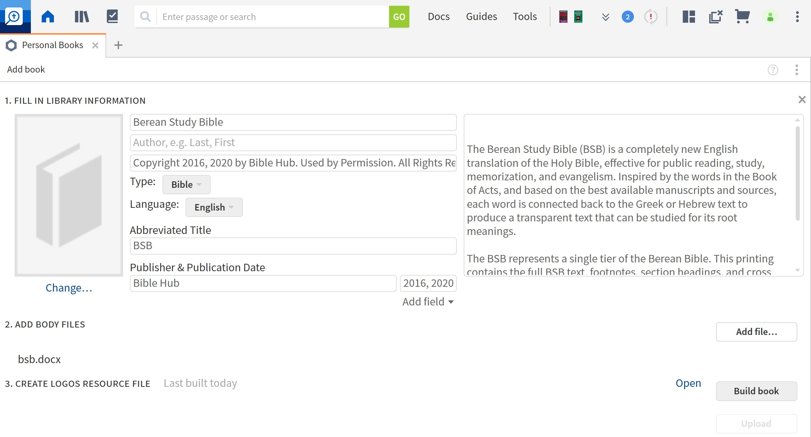

# Berean Study Bible formatted as a Logos Personal Book

The BSB has a very generous license, as seen here: https://berean.bible/licensing.htm. The files in this project contain:  
The Holy Bible, Berean Study Bible, BSB 
Copyright ©2016, 2020 by Bible Hub 
Used by Permission. All Rights Reserved Worldwide. 
https://berean.bible - Berean Bible Homepage

This project contains:

* bsb.html -- Output from BibleMultiConverter (https://github.com/schierlm/BibleMultiConverter), using USFM files from https://berean.bible/downloads.htm as an input, and LogosHTML as the output type.
* bsb.docx -- Result of loading bsb.html into LibreOffice, and saving as a docx file.

To load the BSB Personal Book in Logos, go to Tools->Utilities->Personal Books, click Add Book, and fill it out something like the following:

Click Add file..., and select bsb.docx from this repository.
Finally, click on the Build book button, wait a while, and you should have the BSB in your library.
At this point, you can make the BSB your preferred bible if you wish, and use it like any other Bible in your library.

I didn't throughly proofread this conversion of the BSB, but I did spot checks, and it looks ok. Please let me know if you find any issues, or if you would like to contribute additional formatting to this book! 